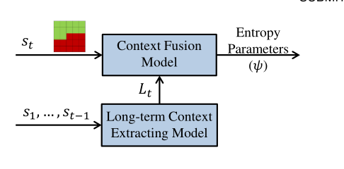
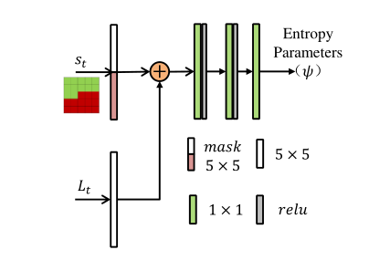
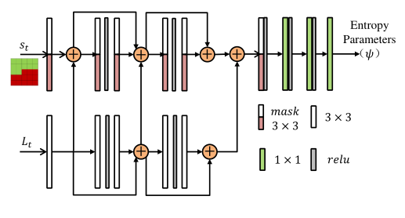
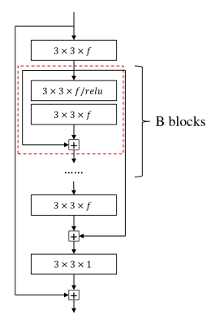
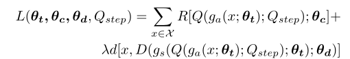
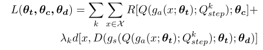
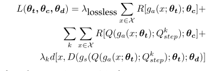
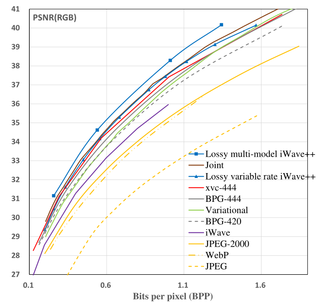
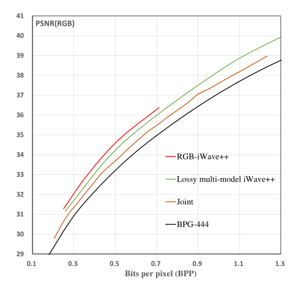
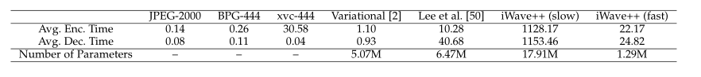

@[toc](End-to-End Optimized Versatile Image
Compression With Wavelet-Like T ransform)

论文地址：[https://ieeexplore.ieee.org/document/9204799](https://ieeexplore.ieee.org/document/9204799) 

代码地址：[https://github.com/mahaichuan/Versatile-Image-Compression](https://github.com/mahaichuan/Versatile-Image-Compression)

    中科大产出的TPAMI论文，是目前image compression除了Hyper论文创新性最强的论文了吧? (个人看法)

# 一. 简介
&nbsp;&nbsp;&nbsp;&nbsp;&nbsp;&nbsp;&nbsp;以前的研究通常采用压缩自动编码器，其中编码器部分首先将图像转换为潜在特征，然后再对潜在表示进行量化。变换和量化都产生了信息损失，导致难以最佳地达到任意压缩比。本文将IWAVE ++作为一种新的端到端优化图像压缩方案，其中IWAVE是训练有素的小波变换，将图像转换为系数而没有任何信息丢失。然后，变换系数可选地被量化并编码成码流。不同于先前的方案，IWAVE ++是多功能的：单个型号支持无损和有损压缩，并且还通过简单地调整量化规模来实现任意压缩比。 IWave ++还具有精心设计的熵编码引擎，用于逐步对系数进行编码，以及用于有损压缩的脱量化模块。
# 二.内容
## 2.1 现有方法缺陷

 1. 目前的框架中，编码变换与解码变换，并不是强绑定关系，即编码器和解码器不是一对可逆的变换，并且编码器无法解决在编码过程中产生的信息损失问题，即使用原图输入，不量化也没办法100%恢复出原图。
 2. 现有的编码架构很难实现可变速率的架构（包括这篇论文，已知有三篇论文了），即单模型多码率的框架。

## 2.2 端到端新框架
整体框架图如下：

&nbsp;&nbsp;&nbsp;&nbsp;&nbsp;&nbsp;&nbsp;遵循压缩领域的整体框架，整体由以下几个模块构成，编码器提供变换产生变换系数，地位等价于其他框架中的特征图，但是这里对标了传统编码领域的变化系数。随后进行量化，熵编码，熵解码，反量化，解码器提供逆变换，最后对输出Rec图。其中，这个框架内**每一个模块**的实现，都值得学习，很巧妙的设计。

## 2.3 编码变换
&nbsp;&nbsp;&nbsp;&nbsp;&nbsp;&nbsp;&nbsp;编码器的提升方案由三步构成：分离，预测，更新。具体以一维信号为例子，将一维信号分为两个部分，其偶数部分：$x_e$，和奇数部分：$x_o$，巧妙的来了，其中能够使用$x_e$这一部分去预测$x_o$：
$$h=x_o-P(x_e)$$
$P()$ 表示一种用于预测的特殊滤波器，通常情况下，$h$包含了$x$的高频信息，下一步进行更新：
$$l=x_e+U(h)$$
$U()$ 表示另外一种用于更新的滤波器，并且一般$U$表示低频分量。预测和更新组成了提升方案的基本模块单元（以下称呼为分解单元好了，个人称呼的不代表官方），而多个这种模块的基本单元，构成了整个编码器的网络。$x$ 经过编码器变换，生成了代表高频分量的$h$,和代表低频分量的$l$，后续的量化和熵编码等操作都是对$h$和$l$进行的。假设不进行量化，即进行无损压缩，此时解码端拿到$h$和$l$的数据，则恢复到 $\hat{x}$ 的描述如下：
$$x_e=l-U(h)$$
$$x_o=h+P(x_e)$$
$$\hat{x}=M(x_e,x_o)$$
获得最终的重构图，并且此时$\hat{x}=x$，通过这种加减的形式，可以很好的避免了对权重矩阵求逆的方式进行解码逆变换，并且这样的操作好像也不现实（好像是求逆），这种形式可以完成编码端和解码端的强绑定，保证了变换过程的无损。以下为编码端和解码端的一种绑定关系情况，如下，不过这个方案是一维信号的方案（IWAVE），这篇论文的 方案代号IWAVE++，更强！：

其中关于$P_i$和$U_i$的滤波器模块描述如下：
  

其中3x3表示卷积核大小，16是输出的通道数量，tanh表示输出后采用的激活函数，大致采用了一种残比较特殊的残差块，值得注意的是，输入的通道和输出的通道都为1.

这个图是单步的分离，提高，更新的流程图，这里描述二维信号的IWAVE++的情况，$x$在输入到第一个分解单元先按照行数的奇偶进行分离，得到两组数据$x_e$,$x_o$，这两组数据经过了$P()$,$U()$滤波器的变换，分别得到了$L$低频分量和$H$高频分量（为什么他们代表高低频分量其实并不理解，不过好像不重要。）得到的$L$和$H$再分别经过列的分割，根据奇偶各自分成了两个数据，再进行一波滤波，如上图得到了最后的四组数据。这个是一次的分离单元流程图，后续会对$LL1$这个块进行进行进一步的细分，把这部分的信息输入到下一个分离单元中。具体一个Patch的大小输入进来的话，其具体的分块结果如下：

这个是三层的分离单元对于输入图像的分割情况，最后会得到{$LL_D$,$HL_D$,$LH_D$,$HH_D$,...,$LH_1$,$HH_1$,$HL_1$}个子带，并且绿色线条表示了对于子带的编解码顺序，符合传统的Z-SCan的顺序，即根据小波变换理论中的重要性进行决定的扫描顺序。这种顺序会在实际的熵编码和解码中体现，并且下面的熵模型建模也会体现这一性质。具体实际代码中，并不一定会是产生这么少的子带数量，需要输出$LL$,$HH$查看一下，是否真的如论文所言，分别代表这低频分量和高频分量，一致对最低频的分量进行分解这是为啥？这种层级结构有啥好处？ 如果都是平级的拆解可以会ok吗？

结束关于变换的论述，确实是牛皮！！！！

## 2.4 量化

&nbsp;&nbsp;&nbsp;&nbsp;&nbsp;&nbsp;&nbsp;对于无损压缩过程，为了保证每一步的过程产生的都是整形，每一步得到的$h$,$l$都会进行量化操作，同样的相似的舍入量化模块也会被部署到反变换过程，这样就能保证每个变换模块的输入是整数，有利于，并且保证了反变换模块的一致性，保证了无损压缩的合理。
$$h=x_0-[P(x_e)]$$
$$l=x_e+[U(h)]$$
这部分的公式需要结合Inverse transform来看，再提一下这部分变换量化后的公式：
$$x_e=l-[U(h)]$$
$$x_o=h+[P(x_e)]$$
$$\hat{x}=M(x_e,x_o)$$
可以看出在得到$h$,$l$之后，可能无损得恢复得到输入的数据，传统的量化操作会导致一致的信息损失，从而导致压缩是有损的，而这里的量化更加奇妙，也是由于巧妙地变换模块地设计吧，这种量化操作更倾向于归到变换的一部分， 不同于L3C估计码率的做法，这种方式每个模块的输入输出都是在整数上进行的，更加地巧妙。

## 2.5 熵模型

&nbsp;&nbsp;&nbsp;&nbsp;&nbsp;&nbsp;&nbsp;这个模型并不是直接对量化后的系数进行熵编码的，而是对量化系数的索引进行编码，通过熵模型学习索引$q$的概率分布情况,其整体的方式如下，
 

这对每一个由变换得到的子带{$LL_D$,$HL_D$,$LH_D$,$HH_D$,...,$LH_1$,$HH_1$,$HL_1$}，如上图记为: $S$，当前子带的记为：$S_t$，对当前块内的索引进行建模的时候，会参考以前的每一个已经解码的子带的情况，而在这个自带之前解码的子带会经过LSTM得到输出的结果，这部分由于不同等级的子带其分辨率不同例如{$HH_1$,$HH_2$}，会由LSTM内部设置上采样网络是的分辨率进行对齐。LSTM的输出结构与当前自带经过Mask Conv的输出结果进行如下图所示的运算：
 

这一版本为“轻量版”的熵模型设计，通过1x1的卷积层，不采用更大核大小是为了不破坏解码的因果关系，即保证训练过程中不使用已经解码的信息，保证解码端能够正确解码。
 
这个是实验中采用的“加强版”的熵模型设计，其拟合能力更强，预测更加精准。而熵模型的预测的参数如Balle_2017（我看的版本引用是Hyper的那篇，但是好像内容对不上，我就改成了end-to-end 2017那篇了）论文中一直，通过预测某种分布的参数进行概率密度模型建模。

&nbsp;&nbsp;&nbsp;&nbsp;&nbsp;&nbsp;&nbsp;具体建模方式公式如下，计算累计分布C(x)：
$$C(x)=f_K(f_{K-1}(...f_1(x)))$$
在论文中$K=5$,其函数表示为：
$$f_1(x)=g_1(H^1x+b^1)$$
$$g_1(x)=x+a^1 \cdot tanh(x)$$
最后一层的$f_K(x)$表示为：
$$f_K(x)=sigmoid(H^Kx+b^K)$$
每一层的输出作为下一层的输入，而本文采用的熵模型是针对每个通道进行的，需要训练的参数就是$H$,$b$,$a$三个矩阵。不同与Balle_2017的论文，本文的参数结果是会在推理阶段根据内容自适应地进行修改，而Balle_2017并不会，即本文有自适应上下文的功能，而Balle_2017没有。并且对标balle_2018 Hyper的论文，本文进行通道级的自适应建模，但是不进行特定的概率密度函数的假设。Balle_2018则是进行像素级自适应的高斯分布建模。

## 2.6 反量化

&nbsp;&nbsp;&nbsp;&nbsp;&nbsp;&nbsp;&nbsp;这部分内容不同与之前的端到端图像压缩的工作，由于之前的端到端工作其编码端和解码端的变换不是绑定关系的原因，所以其实解码端的网络本身就具有反量化的功能，而本文中由于存在着强绑定的关系，所以需要反量化模块降低量化造成的损失问题。具体反量化的网络如下图所示：
 
这种方式更像是一种降噪处理，将量化认为是一种噪声，而对噪声进行清除，还原原来的像素值。

# 三.配置

&nbsp;&nbsp;&nbsp;&nbsp;&nbsp;&nbsp;&nbsp;JPEG200中有两种小波变换，一种是CDF 5/3，另一种是CDF 9/7 （不太清楚这两种变换情况的差别），前者只有整数形式的算术编码，而后者支持浮点型的算术编码，对于无损压缩情况下，只能采用CDF 5/3 的形式进行编码，而对于有损编码来说，则两者方式都可以采用。
&nbsp;&nbsp;&nbsp;&nbsp;&nbsp;&nbsp;&nbsp;针对有损的可变速率模型，许多之前的工作都是针对不同的码率训练多个模型，在本文的框架中，也可以实现多模型的的情况，具体公式如下：
 
其中$Q_step$为量化步长。$\lambda$为超参数，权衡码率与失真的权重关系，通过调节$\lambda$训练多个模型情况。
而针对多码率的情况，其最终的Loss function如下：
 

通过选取$\lambda_k$数值k={1,....K}，并且$Q_k$是量化步长，通过$\lambda_k$映射得到。并且$Q_k$只用于训练阶段，在测试阶段可以使用任意尺度的量化进行可变速率的压缩。
&nbsp;&nbsp;&nbsp;&nbsp;&nbsp;&nbsp;&nbsp;本文提出的模型是既可以进行无损压缩和可变速率的有损压缩的其优化公式如下：
 
在本文中，$\lambda_lossless$被设置为1.即第一行为无损情况下的lossfunction，第二第三行为可变速率情况下的损失函数。具体训练策略是一种轮换的训练策略，将模型分为两组的参数训练{$\theta_t$,$\theta_d$}(前者是卷积核的参数，后者是码率估计的参数)，{$\theta_c$} 这个是反量化的参数。训练会对这两组参数进行来回迭代训练，先冻结前面训练几个iteration,再冻结后面的参数训练之前的参数迭代几个iteration。这样有利于收敛？？？？不太清楚为啥。

&nbsp;&nbsp;&nbsp;&nbsp;&nbsp;&nbsp;&nbsp;另外由于是2D的小波变换，也可以支持三通道的RGB，但是这样就受限于特定的颜色空间格式了，所以对图像进行YUV格式的输入，分别对每个分量进行编解码，这也符合本文2-D小波变换分解的思想，可以对于编解码结果进行任意的颜色空间转换。

## 四. 实验结果

粗略介绍一下模型的性能，其在Kodak数据集的PSNR性能如下：
 

可以看出，多模型的PSNR性能大约比BPG高出了0.5db，而可变速率的模型由于Loss function的变化导致性能相比于多模型算法性能有所下降。

而针对固定颜色空间下的性能展示如下：
 

相对于针对单个分量进行训练，直接输入3-D信号的固定颜色空间下，其压缩性能更有优势。而在时间方面，由于熵模型的串行问题，导致本文提出的模型编解码速度大大增加，而采用了并行化技术之后，对每一个具体如下：
 

比Lee版本的编解码速度还大是真的离谱，后续并行版本的采用小块并行地进行编解码，加快了不少，但是还是很久啊=-=。具体怎么并行地，就没关注了=-=。