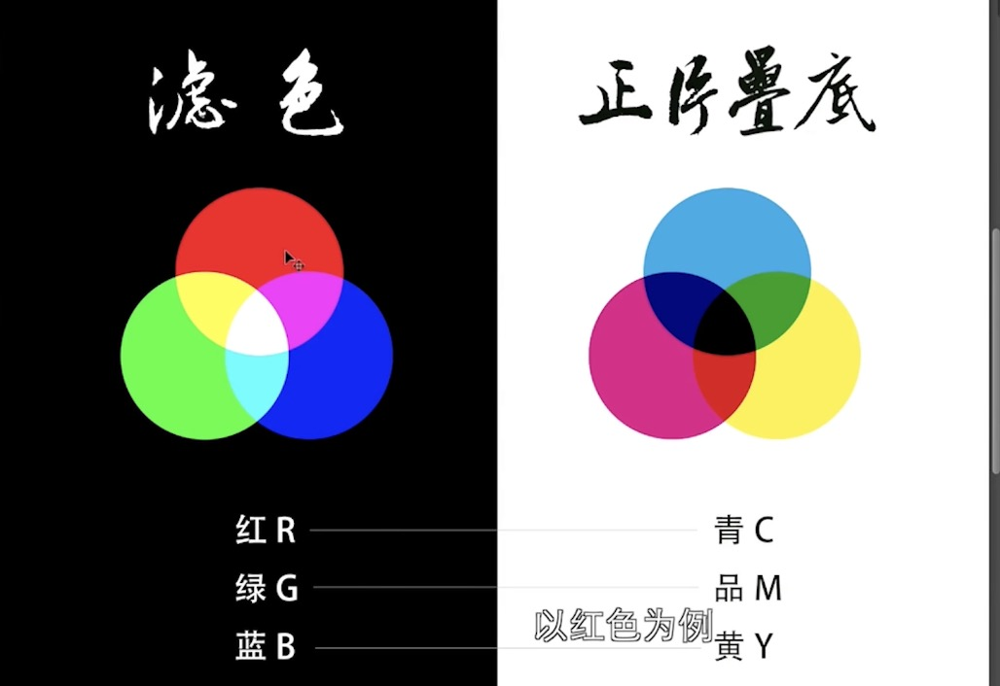

# 用于ps的笔记记录

## 光和色的关系

## 三原色原理

以蓝天为切入点，体现原始的蓝天的通透性质，具体调色原理ps笔记参照三原色的调色图：

 

# 2 人像精修

1. 对于人像中的粗糙信息包括痘痘等等进行处理。
2. 进行液化处理，包括瘦脸，粗细平滑，笑脸弧度等等
3. 三个加深减淡工具，中性灰，双曲线，明度（用的最少，所以不介绍）。
4. 进行磨皮，包括高低频分离，反相高反差，通道磨皮
5. 五官精修

## 2.1 处理异常点
污点修复画笔，仿制图章等等

## 2.2 液化
会使用液化工具让人物整体结构更加圆润，并且使用液化进行瘦脸，瘦手臂，以及使用平滑工具是的野花操作更加地自然

## 2.3 三个加深减淡工具
通过加深减淡工具进行进一步精修，调节整体的色彩平衡度的问题，包括黑眼圈等等。

### 2.3.1 中性灰流程

1. 创建新的图层，填充50%的灰度，具体RBG都为128，将该图层的模式更改为柔光模式。
2. 观察图像的光影，方便判断图像的光影内容，选去黑白色的渐变映射。然后选取曲线压暗整体，并且再新建曲线打开图像的对比度，进一步暴露人像中的斑点情况，一般会把这部分处理放在一个组内。
3. 一般情况下，先调整整体的明暗程度，再调整局部细节的情况。使用白色画笔擦拭中性灰的图层，一般画笔的流量和平滑度选取为5%或者10%，直接擦拭图层可以调节光照情况。

### 2.3.2 双曲线流程

1. 创建两个曲线，一个曲线是提亮的，一个曲线是压暗的，并且对他们的蒙版填充黑色。
2. 使用白色画笔，控制画笔的不透明度and平滑为5%或者10%。对于要提亮部分的使用白色画笔在蒙版中进行操作。

对于中性灰和双曲线的优势以及劣势，两者的作用差不多，中性灰比较简单，而双曲线比较复杂。中性灰的缺点在于提亮的程度比较局限，有一个提亮的程度，且较低。双曲线的提亮程度远比中性灰的程度要高。

## 2.4 磨皮的三种方式

### 2.4.1 高反差保留

1. 在原来图层的基础上，滤镜--其他---高反差保留，选取半径，教程中为6，选取线性光，然后ctrl+i 反向选取皮肤。
2. 滤镜---模糊---高斯模糊，选择半径为6，确定。
3. 添加蒙版，全部为黑色，然后用白色画笔擦拭皮肤的内部细节，对细节进行恢复。画笔参数，流量100%，平滑10%

一般不直接采用这种方式，都是采用中性灰之类的进行处理，处理结束后进行中性灰即可。

### 2.4.2

