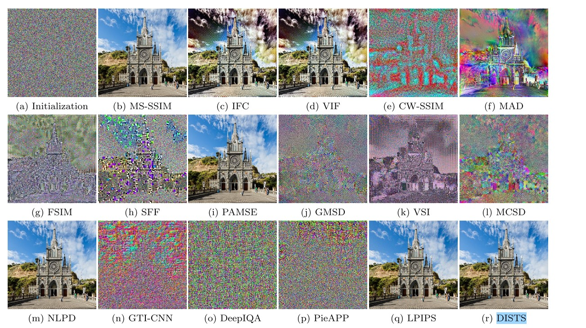
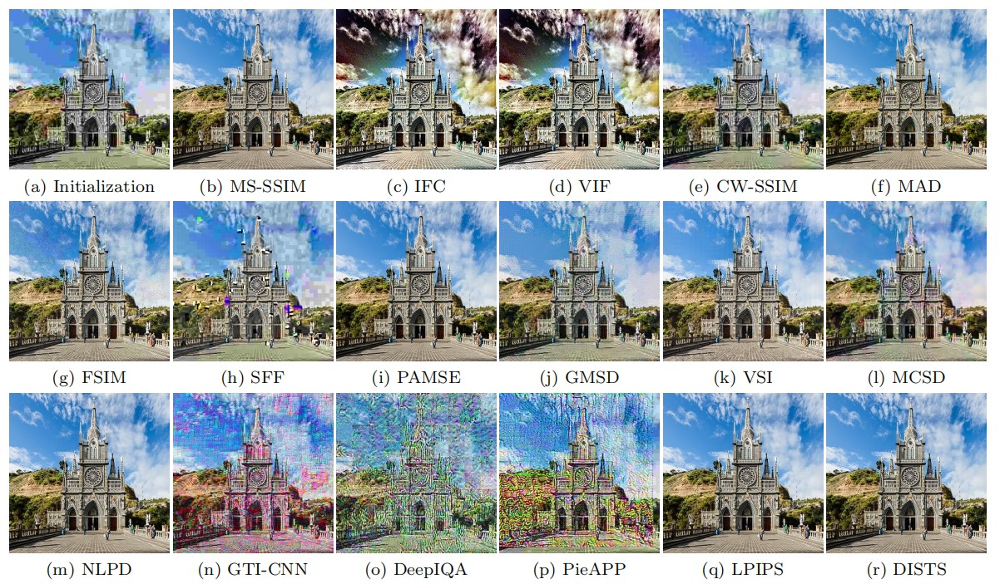
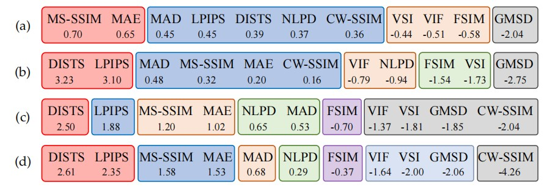

《Comparison of Full-Reference Image Quality Models for Optimization of Image Processing Systems》
论文地址：[Comparison of Full-Reference Image Quality Models for Optimization of Image Processing Systems](https://link.springer.com/content/pdf/10.1007/s11263-020-01419-7.pdf) 

代码地址：

    2021 IJCV

# 一. 简介
&nbsp;&nbsp;&nbsp;&nbsp;&nbsp;&nbsp;&nbsp;主要通过将模型预测与人类质量判断进行比较来评估客观图像质量评估 (IQA) 模型的性能。 为此目的收集的感知数据集为改进 IQA 方法提供了有用的基准，但它们的大量使用会产生过度拟合的风险。对 IQA 模型作为优化图像处理算法的目标进行了大规模比较。 具体来说，使用 11 个全参考 IQA 模型来训练深度神经网络以完成四个低级视觉任务：去噪、去模糊、超分辨率和压缩。 对优化图像的主观测试使我们能够根据感知性能对竞争模型进行排名，阐明它们在这些任务中的相对优势和劣势，并提出一组理想的属性以纳入未来的 IQA 模型

# 二. 内容

## 2.1 贡献
1. 训练了十一个IQA模型指导低级视觉任务

## 2.2 全参考图像模型分类
整体框架图如下：
1. Error visibility methods，MSE 具有用于优化的有用属性（例如，可微性和凸性），并且当与线性代数工具结合使用时，通常可以获得解析解。 例如，MSE 最优去噪问题（假设平移不变的高斯信号模型）的经典解决方案是维纳滤波器（Wiener，1950）。 鉴于像素域中的 MSE 与感知图像质量的相关性很差，许多 IQA 模型通过首先将图像映射到更适合感知的表示来操作。
2. Structural similarity (SSIM) methods，构造的相似度度量局部图像“结构”，通常使用相关度量。原型是SSIM指数(Wang et al.， 2004)，它结合了提取的特征信息进行相似度计算，这一指标成为了传统评价行业的标准。
3. Information-theoretic methods 测量被感知的参考图像和被扭曲的图像之间相互信息的近似值。对图像源、畸变过程和人眼视觉系统(HVS)进行统计建模是该算法发展的关键。一个典型的例子是视觉信息保真度(VIF)测量。
4. Learning-based methods 从一组训练图像和相应的感知距离中学习度量。通过利用dnn的能力，这些方法在现有的图像质量数据库上取得了最先进的性能，这些方法容易对有限的可用数据进行过拟合。弥补标注训练数据不足的策略包括建立预训练网络、局部图像补丁训练以及组合多个IQA数据库。
5. Fusion-based methods 旨在构建一个“超级评估器”，利用其组成方法的多样性和互补性融合组合可以通过经验判断，也可以从数据中学习。有些方法结合确定性或统计图像先验来正则化IQA度量(Jordan, 1881;Ulyanov等人，2018)。由于这些正则化器可以被视为一种无参考的IQA度量，也将其视为融合解决方案
   
## 2.3 合适的优化模型

使用高斯噪声模型的降噪结果：

 

去jpeg压缩伪影结果：

 

最终的工作排名情况，下面分别为降噪，去压缩伪影，超分辨，端到端图像压缩方式：

 

