《ESIM: Edge Similarity for Screen Content Image Quality Assessment》
论文地址：[ESIM: Edge Similarity for Screen Content Image Quality Assessment](https://eezkni.github.io/publications/journal/ESIM/ESIM_ZKNI_TIP17.pdf) 

数据集和代码位置：[https://eezkni.github.io/publications/ESIM.html](https://eezkni.github.io/publications/ESIM.html)

    2017—TIP

# 一. 简介
&nbsp;&nbsp;&nbsp;&nbsp;&nbsp;&nbsp;&nbsp;提出了一种精确的全参考图像质量评估(IQA)模型，该模型用于评估屏幕内容图像(scsi)，称为边缘相似度(ESIM)。提取并利用基本的边缘特征对scsi进行IQA。该方法的创新之处在于提取和利用了三种显著的边缘特征、**边缘对比度、边缘宽度和边缘方向**。前两个属性是基于参数化边缘模型从输入SCI中同时生成的，而最后一个属性是直接从输入SCI中导出的。这三个特征的提取将分别用于参考SCI和扭曲SCI。分别计算上述每个边属性的相似度，使用边宽池策略将它们组合在一起，生成最终的ESIM评分。

# 二.内容
## 2.1 现有方法缺陷
1. 有IQA的工作，但是对于屏幕内容内容的IQA并没有发展开。

## 2.2 贡献
1. 增加了使用边缘方向这一特征进行特征评价。
2. 开放了一个数据集
3. 性能达到sota。

## 2.3 整体框架流程
整体框架图如下：

 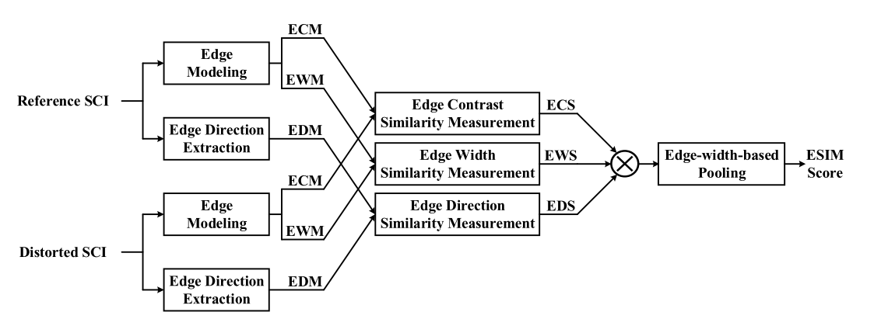

通过参数化模型提取图像的边缘宽度和边缘对比度，使用梯度算子提取图像的边缘方向，分别得到参考图像和当前图像的各个属性的数值，进行对比得分后，将得分输入到基于边缘宽度的池化模块中，得到最终评价得分。

## 2.4 边缘建模

 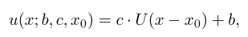

基础是在如上图所示的阶跃信号进行扩展的，图像的边缘可以描述为这一阶跃信号与高斯算子的卷积，表达为：

 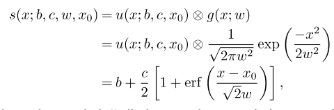

可视化为：

 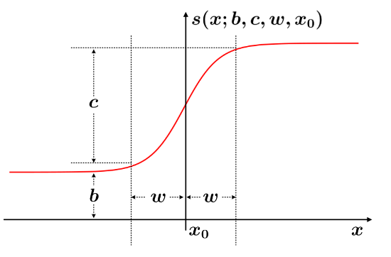

b表示边缘附近的最低偏置，w表示边缘宽度，x0表示边缘的中心点，c表示边缘的对比度，该模型能拟合大部分的边缘情况。问题如下：

1.  如何定位边缘的中心点。
2.  基于每个中心点，确定b,c,w参数

边缘中心可以通过简单地求高斯平滑步长边缘一阶导数的局部极大值来实现，简单来说就是从上图可以看出，这个信号的一阶导数是在x0处最大。所以通过这一方式就可以确定这个边缘信号的中心位置。为了增加提取中心位置的鲁棒性，防止噪声对信号的干扰，在进行一阶微分前，再通过一个高斯核对信号进行平滑（平滑后不影响一阶导数的极值），平滑后再进行局部的一阶求导。（梯度算子即可）
具体经过高斯核且微分后公式如下：

 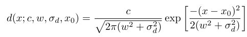

确定好中心位置后，此时x0为定值，为了求解出其他三项，求解多个不等式，设定x=x0+1, x=x0, x=x0-1，得到三条等式:

 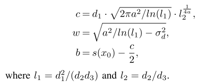

因此可以通过这三条等式求解出信号的边缘对比度，边缘宽度。

## 2.5 边缘方向提取
1. 首先对图像进行一阶的横纵方向的梯度提取，根据横纵方向生成总的梯度图：
 
 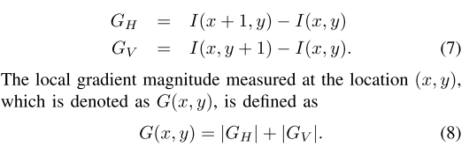

2. 总的梯度图再进一步在12个方向上进行梯度计算，最后汇总12个梯度上的最大值，记录图上的每一个点是在哪个梯度方向达到最大值。即只记录梯度的方向，而不记录梯度的数值。
## 2.6 相似度计算
相似度统一采用下面的公式
 
 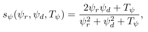

 前两个表示当前图像和参考图像提取的特征，后一个是相对小的常数，防止分母太小使得数值产生巨大的波动，并且保证最终数值在(0,1].
 
 最后对三种指标的输出进行加权或者一定的运算叠加叠乘，本文采用直接相乘，权重指数均为1.

 ## 2.7 基于边缘宽度的池化

根据视觉系统对不同信息的敏感度，视觉对不同特征的敏感度是不同的，像上述S指标平等地对待三种特征并不合理，作者根据实验得出**边缘宽度**信息是人眼视觉系统最敏感地，提出如下公式：
 
 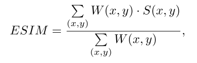

其中

## 三. 实验结果
本文提出的算法：
 
 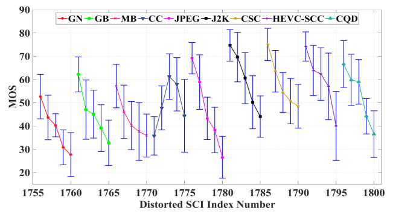

  
 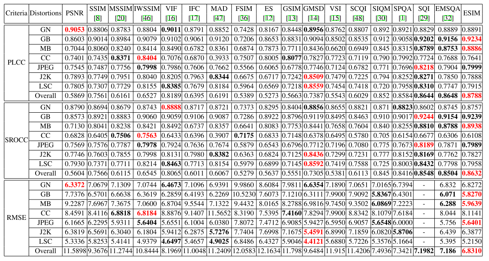
