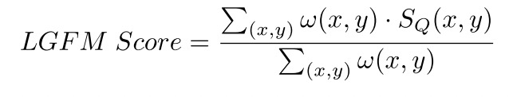

《A LOG-GABOR FEATURE-BASED QUALITY ASSESSMENT MODEL FOR SCREEN CONTENT IMAGES Heng》
论文地址：[A LOG-GABOR FEATURE-BASED QUALITY ASSESSMENT MODEL FOR SCREEN CONTENT IMAGES
Heng](https://ieeexplore.ieee.org/abstract/document/8803491) 

代码地址：[https://blog.csdn.net/m0_60703264/article/details/120377354](https://blog.csdn.net/m0_60703264/article/details/120377354)

    2019 ICIP

# 一. 简介
&nbsp;&nbsp;&nbsp;&nbsp;&nbsp;&nbsp;&nbsp;本文提出了一种用于对屏幕内容图像（S-CIs）进行客观评价的图像质量评估（IQA）模型，称为基于对数Gabor特征的模型（LGFM）。从信号表示的角度来看，对数Gabor滤波器优于经典的Gabor滤波器，因为对数Gabor滤波器的输出与人类视觉系统（HVS）中视觉皮层的感知更加一致。此外，对数Gabor滤波器的以下两个显著特点对开发更精确的IQA模型非常有利；即（i）直流电的零响应，以及（ii）高频的强响应。在我们提出的L-GFM中，对数Gabor滤波器被用来从参考SCI的亮度和失真的SCI的亮度中提取特征，以测量它们的相似程度。与其他两个色度成分的测量值一起，最终的LGFM分数将在汇集阶段的输出中得出。

# 二.内容
## 2.1 现有方法缺陷
1. 传统的Gabor模型具有很好的性能，但是存在频率带宽的限制，针对失真的图像和原始的图像，对于高频部分的处理能力存在不足。
2. 对于直流部分的处理存在不足（非低频），直流部分的图像对于主观的质量基本没有影响。

## 2.2 贡献

1. 提出使用log Gabor滤波器替换传统的滤波器进行工作，其对于直流分量的0响应和对于高频分量的强响应更加符合人眼视觉系统。

## 2.3 滤波器表达

传统的Gabor滤波器表达式如下：

 

存在上述的缺陷，故而作者将Gabor调整为log Gabor滤波器进行特征提取：

 

其中参数的表达如下

 

其中$k_{\beta}$参数控制着滤波器的可接受贷款范围，在本文中设置$k_{\beta}$=0.41，这个参数下的滤波器其可接受的带宽为3个8度，具体啥意思我也不太懂。

## 2.4 整体框架

整体框架图如下：

 

传统的图像质量评价的方式大多采用特征提取的方式，然后对特征进行相似度计算，分别得到各自特征的相似度的情况，最后讲各个特征的相似度放进Pooling中进行融合，得到最终的得分。

1. 使用对应的滤波器对图像的亮度信息进行横向滤波和纵向滤波，对应结果相加得到亮度信息的特征信息。
2. 对应色度信息，并不提取特征点，直接输入到相似度计算的模块，直接计算相似度。

## 2.4 相似度计算
对应亮度分量的相似度计算如下：

 

这部分的公式都大同小异，基本上大部分的特征提取方式的idea，最后提取到特征后，都会采用这种相似度的评价形式。基本不变。对于色度信息，其计算也是大体不变：

 

最后结合亮度信息和色度信息，得到local quality score：

 

此处的参数 $\alpha_1=1$,$\alpha=0.04$.

## 2.5 池化策略
具体的local quality分配的权重矩阵计算如下：

 

最终的得分如下：

 

## 三. 实验结果
本文提出的算法：

 
