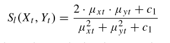

《Perceptual Quality Assessment of Screen Content Images》
论文地址：[Perceptual Quality Assessment of Screen Content Images](https://eezkni.github.io/publications/journal/ESIM/ESIM_ZKNI_TIP17.pdf) 

数据集位置：[http://smartviplab.org/pubilcations/SCID.html](http://smartviplab.org/pubilcations/SCID.html)

    2017—TIP

# 一. 简介
&nbsp;&nbsp;&nbsp;&nbsp;&nbsp;&nbsp;&nbsp;译文：为了得到主观质量得分，并调查哪一部分(文字或图片)对整体视觉质量的贡献更大，采用11点数值尺度的单刺激方法，分别获得了对应于整个区域、文本区域和图像区域的三种主观得分,根据主观数据的分析，提出一种加权策略来解释这三种主观得分之间的相关性。此外，设计了一个客观的度量标准来衡量扭曲的视觉质量，通过考虑文本和图像区域的视觉差异来衡量失真的scsi的视觉质量.
# 二.内容
## 2.1 现有方法缺陷
1. 没有基于SCI图像进行IQA的。

## 2.2 贡献
1. 对一个数据集的构成进行了展开。
2. 第一个基于SCI领域做IQA。

## 2.3 整体框架流程
主管评价中，如下图，人眼视觉对于有清晰纹理和对比度的给更多的分数，而对于过曝情况会适当放宽要求。

 

计算锐度是因为它是总结图像中出现的各种畸变的一个好方法，并且提出整体的框架图：

 

根据文本分割索引map，提取图像的文字层的特征以及图像层的特征输入到主管尺度中，得到两组评价结果，并且用权重进行叠加输出，得到最终的权重情况。

基于上述方案，计算参考图像和扭曲图像之间的锐度和亮度相似度，该方法自适应地将文本区域的亮度相似度集成到锐度相似度中，而对图像区域只考虑锐度相似度。

## 2.4 计算方式

对于文字区域的计算：

 

u表示local区域内的均值，x,y 表示参考图像和失真图像，c为常数，防止分母为0.

对于图像区域的情况，采用算子进行不同方向的梯度提取：

 

有四个滤波结果，而最终的值是取到四个滤波结果中，前两个最大值相加。最后关于图像区域的锐度相似度计算如上。

关于图像区域，只进行对比度相似度的计算，对于文本区域，既进行对比度相似度的计算，又进行亮度相似度的计算。并且分配权重

 

对比度相似度的指数$\beta$设置为1，$\alpha$设置为可调整，调整规则如下：

 

其中$v_{1}，v_{2}$分别表示参考图和原始图在文字区域的极大值和极小值的插值。最终$\alpha$表示为：

 

阈值被设置为0.95.

## 2.5 权重策略

根据已经有的研究，计算整张图的A，记为活动图谱，对应的文字区域的活动图谱和图片区域的活动图谱，要在A的基础上乘以之前的指示文字索引掩图。

 

得到对应文字区域或者是图片区域的权重情况，G表示A的高斯加权和，至于为什么要有G，不太清楚。

接着对上述得到的分值图做归一化处理:

 

得到最终的计算方式如下：

$$Q=w_t*Q_t+w_p*Q_p$$

## 三. 实验结果

xx