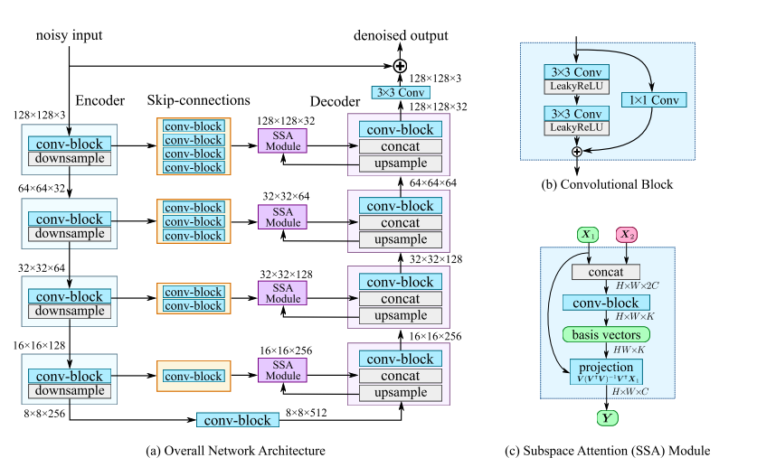

《》
论文地址： 

代码地址：

    xxxxxxxxxxxxxxxx

# 一. 简介
&nbsp;&nbsp;&nbsp;&nbsp;&nbsp;&nbsp;&nbsp;

# 二.内容
## 2.1 现有方法缺陷
1. xx
2. xx
3. xx

## 2.2 贡献
1.

## 2.3 整体框架流程
整体框架图如下：

 

## 2.4 工作1

## 2.5 工作2

## 2.6 工作3

## 三. 实验结果
本文提出的算法：