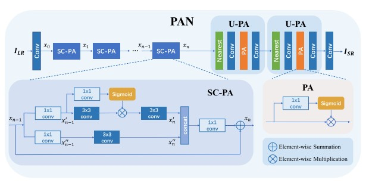

《Efficient Image Super-Resolution Using Pixel Attention》
论文地址：[https://arxiv.org/pdf/2010.01073.pdf](https://arxiv.org/pdf/2010.01073.pdf) 

代码地址：[https://github.com/zhaohengyuan1/PAN](https://github.com/zhaohengyuan1/PAN)

   2022 ECCECCV

# 一. 简介
&nbsp;&nbsp;&nbsp;&nbsp;&nbsp;&nbsp;&nbsp;设计一个轻量级的卷积神经网络，新提出的像素注意方案构建了一个简洁有效的网络。像素注意（PA）与公式中的通道注意和空间注意相似。不同之处在于 PA 生成 3D 注意力图而不是 1D 注意力向量或 2D 地图。这种注意力方案引入了更少的额外参数，但产生了更好的 SR 结果。在 PA 的基础上，我们分别为主分支和重构分支提出了两个构建块。第一个——SC-PA 块具有与自校准卷积相同的结构，但具有我们的 PA 层。这个块比传统的残差/密集块更有效，因为它的双分支架构和注意力方案。而第二个——U-PA 块结合了最近邻上采样、卷积和 PA 层。它以很少的参数成本提高了最终的重建质量。

# 二.内容
## 2.1 现有方法缺陷
1. 现有的注意力机制不是针对像素级的，在超分辨领域表现一般。
2. 注意力机制有助于提高重建质量，但是很少嵌入上采样重建阶段。

## 2.2 贡献
1. 提出一种轻量级，更适合SR工作的注意力机制，并且嵌入到现有的轻量级卷积模块中。
2. 构建了一个轻量级超分辨网络。

## 2.3 整体框架流程
整体框架图如下:

 

整体网络采用16个 SC-PA模块串联提取图像特征，并且使用U_PA对图像进行重构，，SC-PA模块是由已经提出来的SC模块联合本文作者提出的PA注意力模块构成，具有轻量级且高性能的特征。

另外，PA注意力用于上采样U-PA模块，用于提高重建性能。

# 三. 实验结果

## 消融实验
基于基础的RB块实验提出的PA注意力机制的有效性，

 

验证SC模块和RB模块的有效性：

 

验证PA在重建工作中的有效性：

 

## 实验性能
本文提出的算法：

 

图中的表格Mult-Adds的计算基于HR图像为720p的情况下进行的。

对比其他算法：

 

