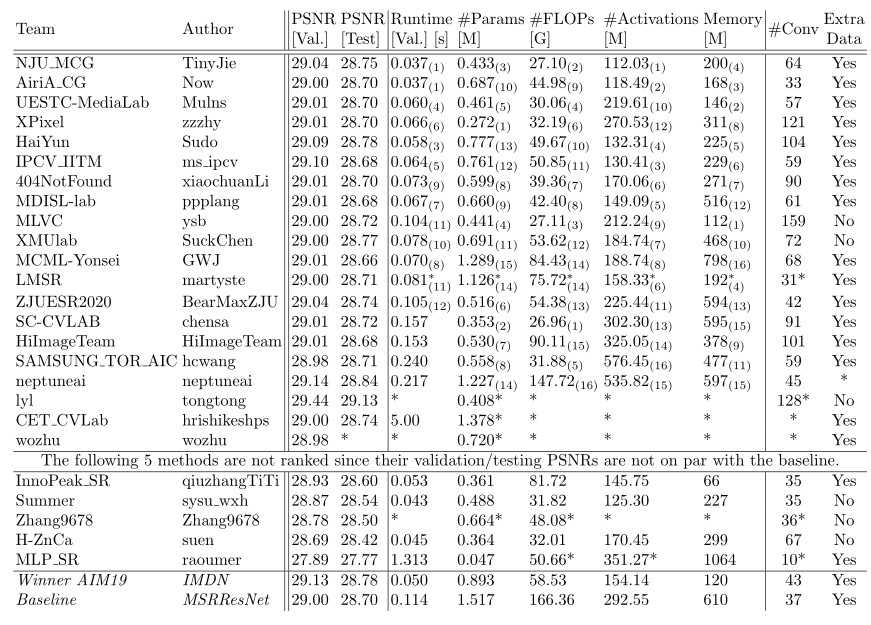
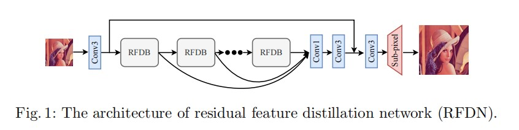
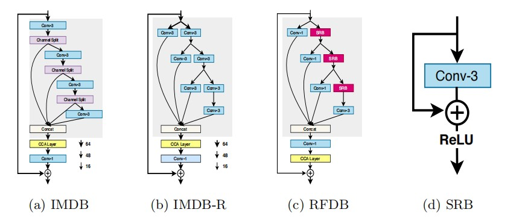
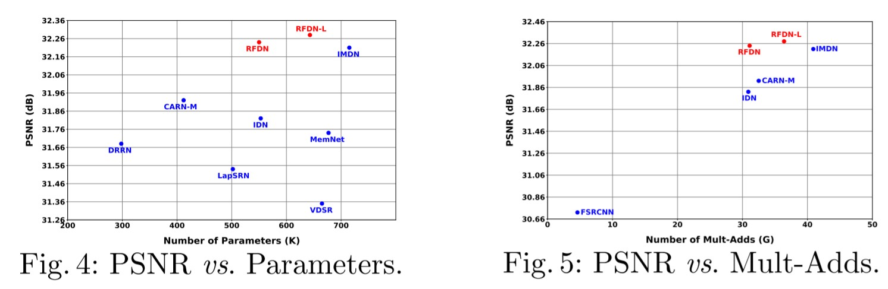
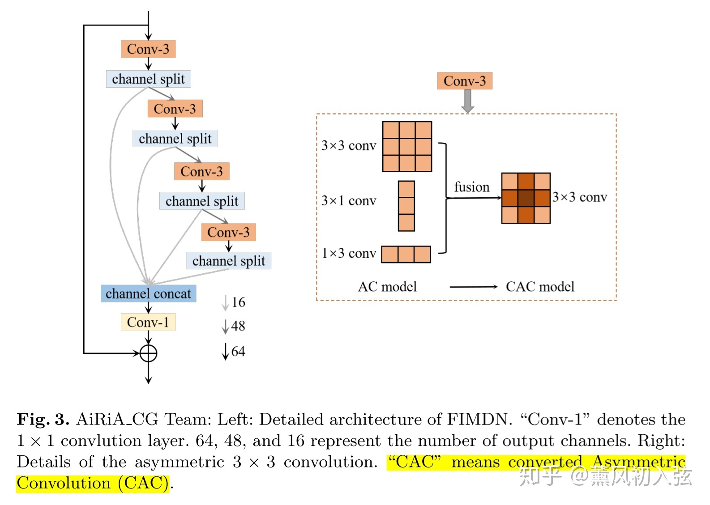

《AIM 2020 Challenge on Efficient
Super-Resolution: Methods and Results》
论文地址：[AIM 2020 Challenge on Efficient
Super-Resolution: Methods and Results](https://arxiv.org/pdf/2009.06943.pdf) 

代码地址：

    AIM2020比赛总结

# 一. 简介
&nbsp;&nbsp;&nbsp;&nbsp;&nbsp;&nbsp;&nbsp;本文回顾了 AIM 2020 关于高效单图像超分辨率的挑战，重点介绍了提出的解决方案和结果。挑战任务是基于一组低分辨率和相应高分辨率图像的先前示例，对放大倍数为 ×4 的输入图像进行超分辨率处理。目标是设计一个网络，减少一个或多个方面，例如运行时间、参数计数、FLOP、激活和内存消耗，同时至少保持 MSRResNet 的 PSNR。赛道有150名报名参赛者，25支队伍提交了最终成绩。他们衡量了高效单图像超分辨率的最新技术。

# 二.比赛内容
## 2.1 超分辨的挑战
1. 设计网络以及损失函数提高对应的超分辨指标。
2. bicubic插值的退化不合理，设计对应模糊核或者更基础的基于标准流的方式解决SR的不适定性的问题。

## 2.2 指标

1. parameters
2. FLOAPs
3. runtime
4. net activation
   
之前的网络在计算轻量级框架的时候，仅仅注意params和FLOPs，但是发现一些框架其params和FLOPs较小但是实际的runtime却比较久，所以需要关注更全面的网络模型的指标。

## 2.3 比赛数据
比赛一般进行x4倍的放大工作，采用DIV2k数据集，包含了1000张图像，800张训练集，100验证集，100张测试集。基于MSRResNet模型上进行改动，base模型在DIV2k的验证机，测试集上的PSNR的性能分别为29.00db和28.7db，软件版本是：PyTorch 1.5.1, CUDA Toolkit 10.2, cuDNN 7.6.2， 平均验证集在TITAN xp上的运行时间是0.11s。 各个参数的评价脚本地址如下：
[https://github.com/cszn/KAIR/blob/master/main_challenge_sr.py](https://github.com/cszn/KAIR/blob/master/main_challenge_sr.py)

比赛排行情况：

 

关于各个评价指标对于runtime的相关性分析：

 

实际上，对于运行时间，Params和FLOPs的相关性并不高，Activations才是贴合度最高的。

# 三 框架优化和主要idea

1. 修改IMDB的多级信息提取块，这个块来自于论文IMDN中的基础块：  **NJU MCG** 提出使用**RFDB**模块，由浅层的残差连接，增强型的空域注意力构成。 **AiRiA CG** 提出减少IMDB的数量，并且使用非对称卷积提高信息提取效率。**ZJUESR2020** 受到IMDB和IdleBlock机制的启发，提出**IdleBlock**。
2. 修改上采样块，在极限模型中，采用 PixelShuffle-> conv->LRelu的方式，**XPixel**使用PixelShuffle nearest neighbor interpolation layer结合attention机制上采样。其他的很多方式基本采用单个PixelShuffle的形式进行上采样。

3. 采用全局特征聚合：**NJU MCG**将每个信息提取块的输出都concat起来，最后用1x1的卷积核进行深层信息和浅层信息的聚合。
   
4. 提供网络剪枝的效果**SC-CVLAB**提出了一种细粒度的通道剪枝策略，以从基于重量级的SR网络中获得轻量级模型

5. 修改基本的RB块结构**XPixel**使用self-calibrated convolution block替换基本的RB块。**404Not-Found** 使用 Ghost-convolution和1x3的网络结构。 **SAMSUNG TOR AIC** 提出使用MobileNet中的基本块构建网络、

## 3.1 NJU MCG 冠军方案

code:[https://github.com/MartinBuessemeyer/Efficient-Image-Super-Resolution](https://github.com/MartinBuessemeyer/Efficient-Image-Super-Resolution)

整体框架：

 

修改原始论文中的基础模块：

 

论文性能：

 

## 3.2 AiRiA CG 方案

 

也是修改了IMDB模块，把3x3的方案修改为非对称卷积的方案。
训练方式：

1. 在DIV2K+Flicke2K(DF2K)数据集上进行预训练，Loss是L1
2. 在DIV2K上进行微调，此时会增大训练mini-batch中图片切片的分辨率（降低batch-size）。Loss是L2
在DIV2K数据集上微调，进一步降低batchsize，使用L2 loss，降低学习率
3.在这一阶段，最终的FIMDN模型会通过将三个并行的卷积核合并为一个3*3卷积核得到。在DIV2K数据集上使用学习率退火微调CAC模型。

## 3.3 UESTC_MediaLab
滤波器分解，传统的卷积层可以写为：$F_output=F_input*\tilde{k}+b$,对卷积核$tilde{k}$ 分解为N个基核（kernel base），$\tilde{k}=\sum_i\pi_i*k_i$其中${\pi_i}|i=1,2...,N$是一组可以训练的融合权重，过程如下：
刚开始有3个base核参与训练，每个base核都进行初始化每轮都加一个新的base，然后权重融合，不断训练融合。（说实话没懂。）

网络结构修正：普通卷积核换成了分组卷积，使得特征通道数翻倍。LRelu换成了PRelu。

## 3.4 XPixel

提出了一种简单高效的网络 Pixel Attention Network：

 

提出了新的简单高效的注意力机制，采用了新的上采样手法。

## 3.5 HaiYun

 

使用了一种蝶形的卷积核，具体怎么蝶形还不知道。整体网络结构比较简单。
