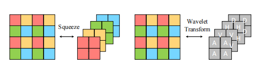
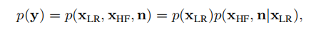
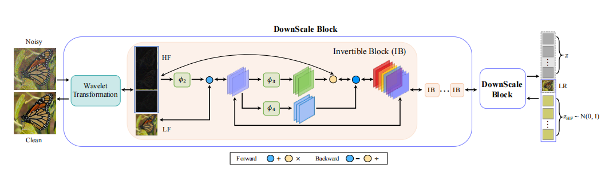
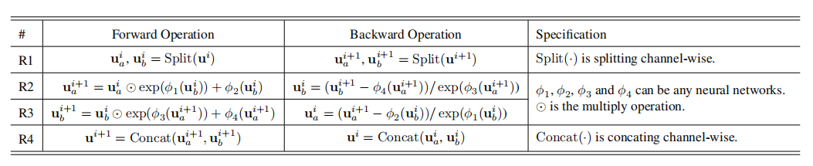
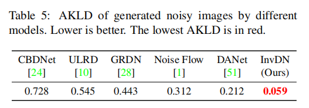
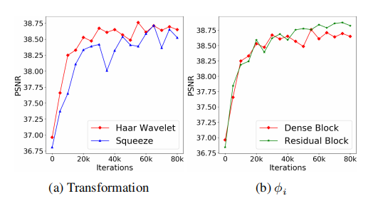
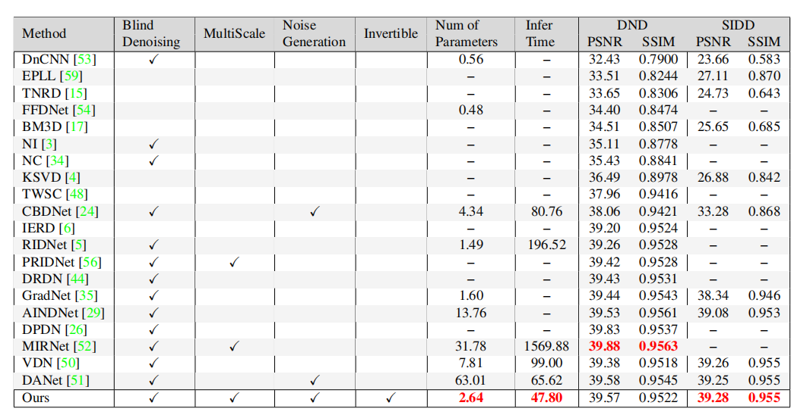

《Invertible Denoising Network: A Light Solution for Real Noise Removal》
论文地址：[Invertible Denoising Network: A Light Solution for Real Noise Removal](https://arxiv.org/pdf/2104.10546v1.pdf) 

代码地址：[https://github.com/Yang-Liu1082/InvDN](https://github.com/Yang-Liu1082/InvDN)

       2021 CVPR

# 一. 简介
&nbsp;&nbsp;&nbsp;&nbsp;&nbsp;&nbsp;&nbsp;可逆网络在图像去噪方面有各种好处，因为它们是轻量级的、信息无损的，并且在反向传播过程中可以节省内存。然而，应用可逆模型来去除噪声是具有挑战性的，因为输入是有噪声的，而反向输出是干净的，遵循两种不同的分布。我们提出了一个可逆去噪网络，InvDN，来解决这一挑战。InvDN将有噪声的输入转换为低分辨率的干净图像和包含噪声的潜在表示。为了丢弃噪声并恢复干净的图像，InvDN用在回归过程中从先验分布中采样得到潜在表示替换噪声。InvDN的去噪性能优于所有现有的竞争模型，在享受更少的运行时间的同时，为SIDD数据集实现了一个新的最先进的结果。此外，与最近提出的DANet相比，InvDN的规模要小得多，只有参数数量的4.2%。此外，通过操纵噪声潜在表示，InvDN也能够产生与原始噪声更相似的噪声。

# 二.内容
## 2.1 挑战
1. 输入是有噪声的，而反向输出是干净的，遵循两种不同的分布,由于在图像的缩放和图像的修复中，两者的应用都是遵循相同分布的情况下的，所以可逆网络能够很好地work，但是降噪不同，需要更细腻的操作。

## 2.2 贡献
1. 提出了一种可逆的网络进行降噪处理，对噪声进行分离，这种网络具有轻量级，低内存，且无信息损失的特点。
2. 从先验分布中找到噪声源并且对剥离的噪声进行替换。

## 2.3 可逆组件

可逆网络最初是为概率模型的无监督学习而设计的。这些网络可以通过双射函数将一个分布转换为另一个分布，而不丢失信息[36]。因此，它可以学习观测的确切密度。利用可逆网络，通过映射一个给定的潜在变量$z$到一个图像实例$x∼p_x(x)$，即$x=f(z)$，其中f是网络学习的双射函数。由于可逆网络的双射映射和精确密度估计特性，近年来受到越来越多的关注，并成功地应用于图像生成[19,31]和缩放[46]等应用

 

这两种变换是可逆的，一种是squeeze-shuffle模式的降采样，一种是wavelet小波变换的降采样。可逆变换不可避免地会进行降采样。

## 2.4 设计理念

根据采样定理，采样后的数据丢失的一般都是高频信息，并且根据观察，一般小波变换后，图像的噪声都集中在高频的部分，所以在进行小波变换后，图像被分为四个部分，1个低频分量和3个高频分量，此时往往低频分量是比较干净的，包含较少的噪声，3个高频分量的噪声应该就比较多了。

根据公式进行分离：

 

$x_{LR}$表示低频的内容$x_{HF}$表示想要恢复的高频细节，我们可以比较容易地分离出干净地低频分量地信息，但是高频分量and噪声地混合信息就很难分离，所以干脆把这部分信息扔掉，重新通过构建z的先验分布获取统计意义上的高频信息。此时$z_{HF}~N(0,I)$ 均值为0，方差为I的高斯分布中进行建模，这里我理解可以进行更深层次的建模，并不局限于使用(0,I)的高斯分布。取代之前丢弃的细节and噪声的混合图。

## 2.5 整体网络结构框架
整体框架图如下：

 

其中可逆块大小的运算如下，其中的参数可以表示任意的卷积核：

 

框架的整体运算是就像上述的框架所示，训练两个流程，在前向的过程中，先要保证生成的LR图像表示低频的情况，所以会对LR的图像和raw的bicubic二次采样的情况作一次loss，保证LR图像的质量。在得到LR后，丢弃其余的高频分量的信息，然后把重新采样得到的信息结合LR输入到可逆变换中，得到的降噪后的图片与原始图做loss function。

## 2.6 蒙卡洛特自证

这里存在一个问题，就是伪造的高频信息存在一定的随机性，这部分随机性无法确切地保证增强后的图像的性能情况，引入蒙卡洛特自证，根据随机性，生成不同情况下$\hat{x}$ 然后去均值，这样的情况下，得到的均值结果比任意一次的结果都要好，次数取16

## 2.7 还可以用于数据增强

在隐变量$z$中加上一个极小的噪声 $z=z+\epsilon*N(0,I)$经过逆变换回原始的图像后，可以得到有噪声的图像，可以用于数据增强，以下表格可以表示这一操作的结果。

 

AKLD表示真实的噪声图和拟合噪声图的相似评价指标，越低越好。

## 三. 实验结果
参数量极小，模型大小只有2.6Mb，下面是相关的实验结果。

 

对比其他算法：

 

主观上不是很能理解这个框架的性能来源在哪里。I等于啥？？？标准正太分布吗=-= 如果进行解耦会发生什么情况？