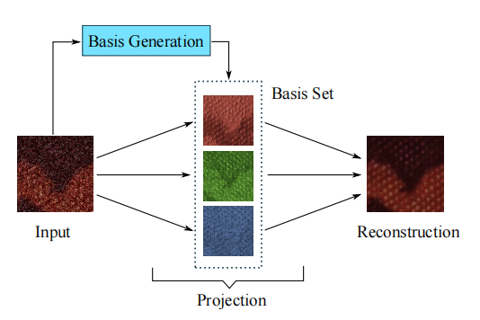
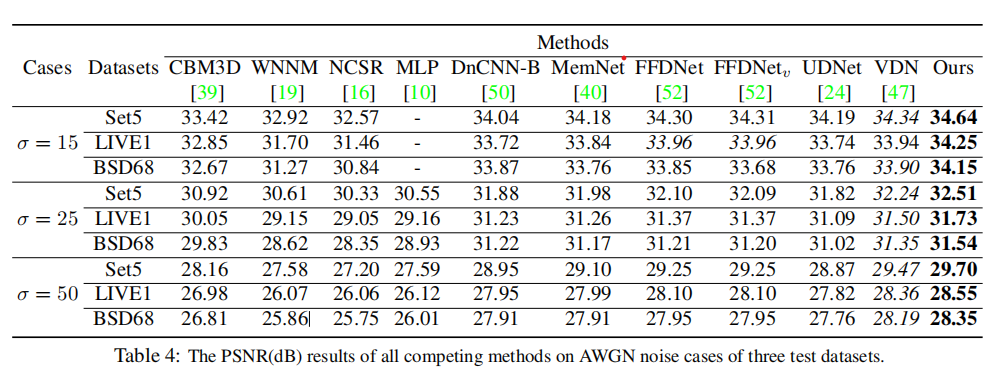
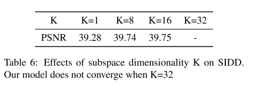

《NBNet: Noise Basis Learning for Image Denoising with Subspace Projection》

论文地址：[《NBNet: Noise Basis Learning for Image Denoising with Subspace Projection》](https://openaccess.thecvf.com/content/CVPR2021/papers/Cheng_NBNet_Noise_Basis_Learning_for_Image_Denoising_With_Subspace_Projection_CVPR_2021_paper.pdf) 

代码地址：[https://github.com/megvii-research/NBNet](https://github.com/megvii-research/NBNet)

# 一. 简介
&nbsp;&nbsp;&nbsp;&nbsp;&nbsp;&nbsp;&nbsp;
从一个新的角度来解决降噪问题:图像自适应投影的降噪，通过在特征空间中学习一组重构基来训练一个能够分离信号和噪声的网络。然后，通过选择信号子空间对应的基，将输入投影到信号子空间中，实现图像去噪。关键观点是投影能够自然地保持输入信号的局部结构，特别是在光线较弱或纹理较弱的区域。为此设计了一个非局部注意模块SSA，用于显式学习基的生成和子空间的投影。
# 二.内容
## 2.1 现有方法缺陷
1. 但在弱纹理或高频细节等硬场景中恢复高质量图像仍然是一个挑战。主要观察是卷积网络通常依赖于局部滤波器对分离噪声和信号的响应。而在低信噪比的硬场景中，如果没有附加的全局结构信息，局部响应很容易被混淆。

## 2.2 贡献
1. 从子空间投影的一个新的角度来分析了图像去噪问题。我们进一步设计了一个简单而有效的SSA模块来学习可以插入普通cnn的子空间投影。

## 2.3 整体框架流程
整体框架图如下：

 

整体设计了类似于Unet网络进行降噪。
核心工作在于右侧的SSA模块，这个模块可以生成偏置基进行信号和噪声的分离，主要想达到的主观效果是下图，这个也是本文的核心观点：

 

通过偏置生成器生成basis vector，然后根据投影运算注意SSA模块的细节，具体关于线性代数的知识:

[https://zhuanlan.zhihu.com/p/330652546](https://zhuanlan.zhihu.com/p/330652546)
得到关于基的投影向量，最后采用1维的范式距离作为loss function。整体流程描述起来很简单，但是能想到用这种投影的形式做就挺厉害的。

## 三. 实验结果
并不是进行真是的去噪结果，而是采用对高斯噪声进行降噪的结果，普遍增加了很牛逼！

 

消融实验的情况，关于多少组基的情况，描绘如下：

 

over！